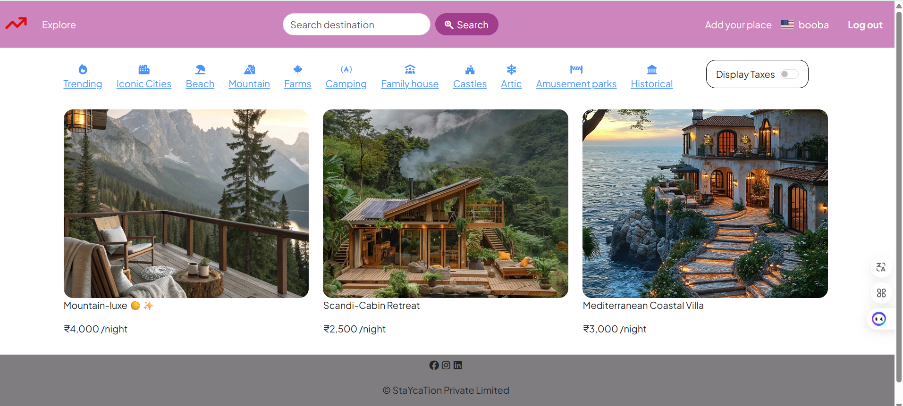

# Staycation 🏡

A property listing web application where users can discover, post, and review properties — inspired by Airbnb. Built with Node.js and deployed on Render.



---

## 🔗 Live Demo

[[staycation.onrender.com] (https://staycation-3oki.onrender.com) ]

---

## ✨ Features

- **User Authentication** — Register, log in, and log out securely using Passport.js
- **Property Listings** — Post listings with images, pricing, and location
- **Category Filters** — Browse by Trending, Beach, Mountain, Farms, Camping, Family house, Castles, Arctic, Amusement Parks, Historical
- **Search** — Search listings by destination
- **Display Taxes Toggle** — Toggle to show/hide taxes on listing prices
- **Interactive Map** — View property location on an embedded map
- **Image Uploads** — Upload property images via Cloudinary
- **Reviews** — Leave reviews on any property listing
- **Responsive UI** — Clean Airbnb-inspired card layout

> ⚠️ Booking functionality is not yet implemented. This is a listing and discovery platform.

---

## 📸 Preview

> Clean, Airbnb-inspired UI with category filters, destination search, and property cards showing pricing per night.

---

## 🛠️ Tech Stack

| Layer | Technology |
|-------|------------|
| Runtime | Node.js |
| Framework | Express.js |
| Database | MongoDB (Mongoose) |
| Authentication | Passport.js (Local Strategy) |
| Image Storage | Cloudinary |
| Deployment | Render |

---

## 📁 Project Structure

```
staycation/
├── controllers/
│   ├── listing.js
│   ├── review.js
│   └── user.js
├── init/
│   ├── data.js
│   └── index.js
├── model/
│   ├── listing.js
│   ├── review.js
│   └── user.js
├── public/
│   ├── css/
│   └── js/
├── routes/
│   ├── listing.js
│   └── review.js
├── utils/
│   ├── countryCode.js
│   ├── expressError.js
│   └── wrapasyn.js
├── views/
│   ├── includes/
│   │   ├── flash.ejs
│   │   ├── footer.ejs
│   │   └── navbar.ejs
│   ├── layout/
│   │   └── boilerplate.ejs
│   ├── listing/
│   │   ├── edit.ejs
│   │   ├── index.ejs
│   │   ├── new.ejs
│   │   └── show.ejs
│   ├── user/
│   │   ├── login.ejs
│   │   └── signup.ejs
│   └── error.ejs
├── .gitignore
├── app.js
├── cloudConfig.js
├── middleware.js
├── package.json
└── schema.js
```

---

## ⚙️ Getting Started

### Prerequisites

- Node.js v18+
- MongoDB (local or Atlas)
- Cloudinary account

### Installation

```bash
# Clone the repository
git clone https://github.com/gitkiya/staycation.git
cd staycation

# Install dependencies
npm install
```

### Environment Variables

Create a `.env` file in the root directory:

```env
MONGO_URL=your_mongodb_connection_string
CLOUDINARY_CLOUD_NAME=your_cloud_name
CLOUDINARY_API_KEY=your_api_key
CLOUDINARY_API_SECRET=your_api_secret
SESSION_SECRET=your_session_secret
```

### Run Locally

```bash
node app.js
```

App will run on `http://localhost:3000`

---

## 🚀 Deployment

Deployed on **Render** using the free tier. Environment variables are configured via Render's dashboard.

---

## 📌 Roadmap

- [ ] Booking functionality
- [ ] Owner contact system
- [ ] User dashboard
- [ ] Mobile responsiveness improvements

---

## 👤 Author

**Kiran Pandey**
- Twitter: [@Kiran426578](https://twitter.com/Kiran426578)
- LinkedIn: [linkedin.com/in/kiran-pandey](https://www.linkedin.com/in/kiran-pandey-8a8b423a2/)

---

## 📄 License

This project is open source and available under the [MIT License](LICENSE).
